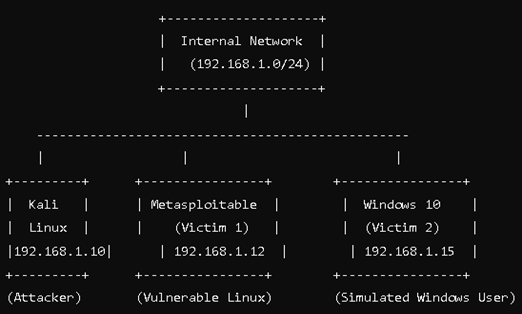
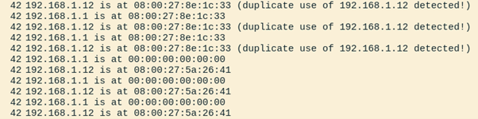
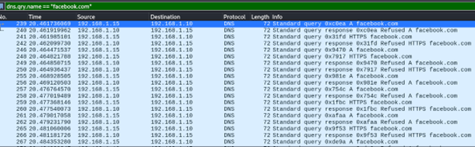
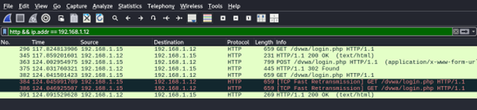
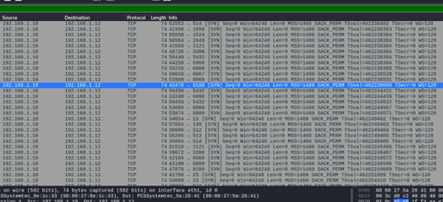

# Network Traffic Analysis & Threat Detection Using Wireshark

## 🔹 Overview
This project demonstrates how Wireshark can be used to analyze real-time network traffic and detect cybersecurity threats.  
Simulated attacks included ARP spoofing, DNS poisoning, Man-in-the-Middle (MITM), and port scanning.

**Tools & Technologies**  
- Wireshark, Kali Linux, Metasploitable 2, VirtualBox  
- Protocols: HTTP, HTTPS, DNS, ARP, ICMP, TCP, UDP  

---

## 🔹 Network Setup
- Attacker: Kali Linux (192.168.1.10)  
- Victim 1: Metasploitable 2 (192.168.1.12)  
- Victim 2: Windows 10 (192.168.1.15)  
- Network: Internal VirtualBox Network (192.168.1.0/24)  

---

## 🔹 Attacks & Detection
### 1. ARP Spoofing
- **Wireshark Filter:** `arp.opcode == 2`  
- **Finding:** Multiple ARP responses from different MAC addresses for the same IP.  
- **Mitigation:** Static ARP entries, Dynamic ARP Inspection (DAI).  

---

### 2. DNS Poisoning
- **Wireshark Filter:** `dns.qry.name == "facebook.com"`  
- **Finding:** DNS queries resolved to attacker IP (192.168.1.10) instead of legitimate server.  
- **Mitigation:** DNSSEC, trusted DNS servers.  

---

### 3. Man-in-the-Middle (MITM)
- **Wireshark Filter:** `http && ip.addr == 192.168.1.12`  
- **Finding:** Captured plaintext credentials (`username: jake, password: mmike`).  
- **Mitigation:** Enforce HTTPS, MFA, disable insecure protocols (HTTP, FTP).  

---

### 4. Port Scanning
- **Wireshark Filter:** `tcp.flags == 0x02`  
- **Finding:** Multiple SYN packets from attacker (192.168.1.10) → suspicious enumeration.  
- **Mitigation:** Firewalls, IDS (Snort), rate limiting.  

---

## 🔹 Conclusion
This project shows that **network anomalies leave identifiable traces in packet captures**.  
By applying targeted Wireshark filters, it is possible to detect ARP spoofing, DNS poisoning, MITM, and port scanning.  

**Key Learnings:**  
- Importance of continuous network monitoring.  
- Critical need for DNSSEC, encryption, IDS/IPS, and strict firewall rules.  
